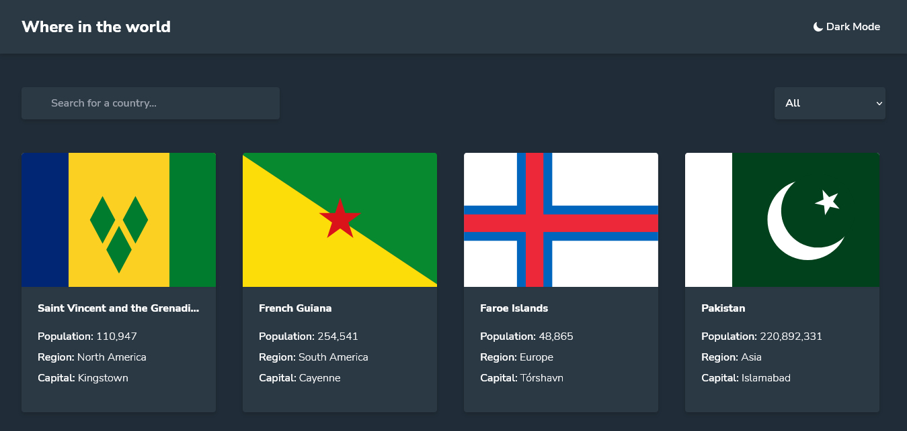

# Frontend Mentor - REST Countries API with color theme switcher solution

This is a solution to the [REST Countries API with color theme switcher challenge on Frontend Mentor](https://www.frontendmentor.io/challenges/rest-countries-api-with-color-theme-switcher-5cacc469fec04111f7b848ca).

## Table of contents

- [Overview](#overview)
  - [The challenge](#the-challenge)
  - [Screenshot](#screenshot)
  - [Links](#links)
- [My process](#my-process)
  - [Built with](#built-with)
  - [What I learned](#what-i-learned)
  - [Continued development](#continued-development)
  - [Useful resources](#useful-resources)
- [Author](#author)

## Overview

### The challenge

Users should be able to:

- See all countries from the API on the homepage
- Search for a country using an `input` field
- Filter countries by region
- Click on a country to see more detailed information on a separate page
- Click through to the border countries on the detail page
- Toggle the color scheme between light and dark mode

### Screenshot



### Links

- Solution URL: [Add solution URL here](https://your-solution-url.com)
- Live Site URL: [Rest Countries FM](https://rest-countries-dina.netlify.app/)

## My process

### Built with

- Semantic HTML5 markup
- CSS custom properties
- Flexbox
- CSS Grid
- Mobile-first workflow
- [Tailwind CSS](https://tailwindcss.com)
- [Vue JS](https://vuejs.org/) - JS library
- [Auto Animate](auto-animate.formkit.com/) - Animation Library
- [GSAP](greensock.com/)

### What I learned

-- I ran into an issue after deploying the app on Github Pages : when the user was not on the index page and tried to reload the page, there was a 404 error. So, the user had to go back to the homepage and reload it before getting the content. I looked up for a solution on the internet but none was satisfying. So, I "migrated" the app to Netlify. There again, the same issue occurred but I found a solution this time. I linked it below in the [Continued development](#continued-development) section.

-- I put into practice my knowledge about consuming an API and dealing with error messages. I learned how to validate data from an API and check if everything was ok before trying to display it to the user interface.

-- I also re-learned how to deal with data coming from localStorage efficiently using JSON.parse().

-- I used another API endpoint after realizing that some countries' information was not easily accessible.

-- Finally, there was some content which required to take values from an object without knowing the keys to get access to it. So, after some research, I came up with this solution :

```js
getValues() {
    //Get the value(s) of an object without knowing its key name
    return (object) => {
    if (!object) return;
    return Object.values(object);
    };
},
```

### Continued development

I had the opportunity to use some modern JS syntax I learned a while back (intl, optional chaining (?.) and the join method). I'll keep them in mind or within reach for future uses.

### Useful resources

- [CSS Ellipsis](https://codefrontend.com/css-ellipsis/) - I used this article to create an ellipsis for overflowing country names on the homepage.
- [Internationalization](https://developer.mozilla.org/en-US/docs/Web/JavaScript/Reference/Global_Objects/Intl/NumberFormat) - This article on MDN helped me format the population number (include commas to make them easily readable).
- [StackOverflow Vue Router](https://stackoverflow.com/questions/59088216/vue-router-link-changes-url-but-does-not-change-router-view-component) - I faced an issue when trying to go from one country to its borders. The url changed but I had to reload the page before getting the new content. The solution was to add :key="$route.path(or fullPath)" to the router-view element, and the issue occurred because vue tries minimal changes.
- 404 error when reloading VueJS on Netlify : I found the solution [here](https://medium.com/@ishoshot/page-not-found-on-reload-vuejs-netlify-c71716e97e6) and [here](https://antonioufano.com/articles/fix-404-errors-with-vuejs-apps-on-netlify/). I used the latter.

## Author

- Frontend Mentor - [@dinadess](https://www.frontendmentor.io/profile/dinadess)
